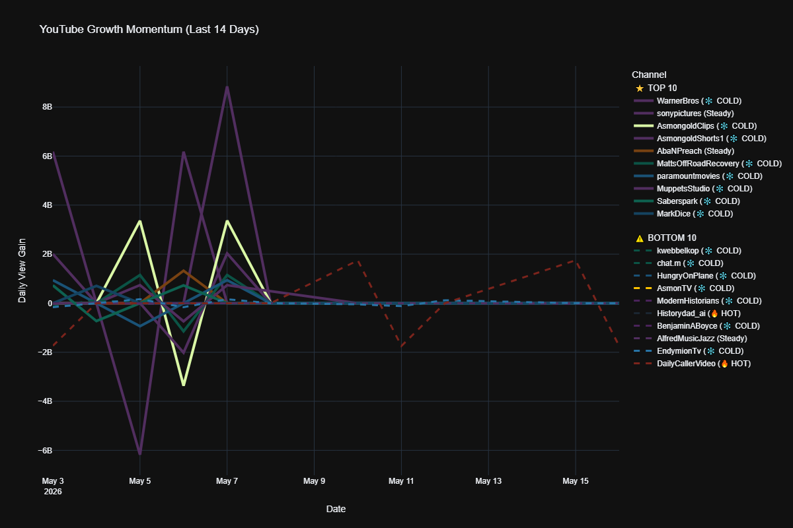
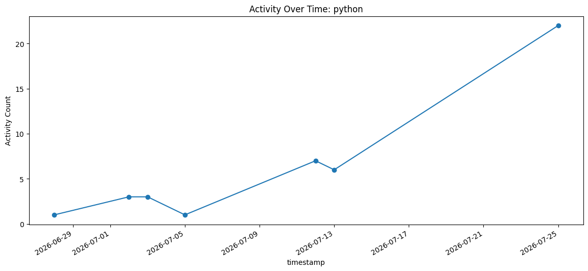

[](https://github.com/JaminShanti.png?size=240)

> Welcome to my retro for the `python` repo (master).

Profile: [https://www.linkedin.com/in/jamin-shanti](https://www.linkedin.com/in/jamin-shanti)

Repo: `git@github.com:JaminShanti/python.git` (branch: `master`)

---

## About Me

* Software developer focused on Python projects and tooling.
* This repository contains a collection of utility scripts for automation, data analysis, and system administration.
* For full professional details see the LinkedIn profile above.

## Table of Contents

- [Scripts Overview](#scripts-overview)
  - [Automation & System Administration](#automation--system-administration)
  - [Data Analysis & Reporting](#data-analysis--reporting)
  - [Market Monitoring & Hobby Projects](#market-monitoring--hobby-projects)
  - [Content Scraping & Analysis](#content-scraping--analysis)
  - [Document Processing](#document-processing)
  - [Miscellaneous](#miscellaneous)
- [How to Run](#how-to-run)
  - [System Prerequisites](#system-prerequisites-windows)
  - [Environment Setup](#environment-setup)
  - [Install Python Packages](#install-python-packages)
  - [Running music_part_splitter.py](#running-music_part_splitterpy)
- [Testing](#testing)
- [Recent Commits](#recent-commits)

## Quick Start

1. **Clone the repository:**
   ```bash
   git clone git@github.com:JaminShanti/python.git
   cd python
   ```

2. **Install dependencies:**
   ```bash
   pip install -r requirements.txt
   ```

3. **Install development dependencies (optional, for testing):**
   ```bash
   pip install -r requirements-dev.txt
   ```

## Scripts Overview

### Automation & System Administration

* **`RecycleWebLogicServer.py`**: A robust script to manage WebLogic server instances (start, stop, restart, suspend, resume) via SSH, with parallel execution support.
* **`getWeblogicServerStatus.py`**: Retrieves the runtime status of WebLogic servers and clusters using WLST (WebLogic Scripting Tool) logic.
* **`svn_compare_f5.py`**: Compares F5 iRules deployed on a BigIP device against versions stored in an SVN repository to identify discrepancies.
* **`Backup_SFCC_S3.py`**: Automates backups or data transfers related to Salesforce Commerce Cloud (SFCC) and AWS S3.
* **`f5_node_health.py`**: Checks and reports on the health status of nodes within an F5 load balancer environment.

### Data Analysis & Reporting

* **`nyse_trending_report.py`**: Generates a high-performance dividend report for S&P 500, 400, and 600 stocks. Uses Yahoo Finance's bulk quote API for speed and exports reports as HTML/PDF.
* **`yt_channel_compare.py`**: Tracks and compares YouTube channel view counts over time with modern interactive visualizations.
  - Generates interactive **HTML** reports, as well as shareable **PNG** and **PDF** exports.
  - Features intelligent legend management (Top N channels) to ensure clarity in large datasets.
  - Supports standalone plot generation without re-fetching data via the `--plot` switch.
  - **Output Organization**: All generated files (daily stats, video trends, plots) are organized into `yt_cache/yt_stats_daily/`, `yt_output/yt_visuals/`, and `yt_output/yt_video_stats/` subdirectories respectively.
  - Built with **Plotly** for modern, interactive visualizations.
* **`rotten_tomato_user_reviews.py`**: Scrapes user reviews from Rotten Tomatoes for movies or TV shows, performs sentiment analysis (rating average), and generates word clouds.
* **`git_log_report.py`**: Analyzes a Git repository's history to generate reports on commit activity, authors, and file changes.
* **`corona_mapping.py`**: Visualizes COVID-19 data, likely creating choropleth maps (e.g., `covid_choropleth_*.html`) to show spread or impact by region.

### Example Outputs

 


 


### Market Monitoring & Hobby Projects

* **`mtg_dip_detector.py`**: Tracks the market value of Magic: The Gathering cards to detect price retracements and identify buying opportunities, particularly useful for monitoring Reserved List assets. Generates PDF and PNG reports of detected price dips.
* **`mtg_scanner_tool.py`**: A custom market data scanner designed to evaluate collection values and optimize deck builds for the Commander format (e.g., Rocco, Cabaretti Caterer).
  - Supports **caching** for faster subsequent runs.
  - Uses an external `excluded_cards.txt` file for easy management of cards to ignore.
  - Retrieves real-time pricing data from multiple sources.

### Document Processing

* **`music_part_splitter.py`**: Automates the extraction of individual instrument parts from full Big Band master score PDFs. 
    + Uses OCR (`pytesseract`) to scan pages and automatically separate parts (1st Alto, 2nd Trumpet, Drums, etc.) into individually named PDF files.
    + Smart multi-page grouping keeps long charts together automatically.
    + Features an interactive CLI Wizard that catches unrecognized or misprinted OCR text, allowing you to manually assign the part.
    + **Self-Learning:** Uses an `instruments.yaml` configuration file. When you correct a misread in the Wizard, the script updates the YAML file to permanently remember the fix for future runs. Completely customizable for any ensemble layout.

### Content Scraping & Analysis

* **`hype_quote_scraper.py`**: Scrapes YouTube transcripts for specific keywords and hype-related phrases. Extracts matched quotes with timestamps and exports them to a text file for easy review and analysis.

### Miscellaneous

* **`lastgitcommit.py`**: A utility to retrieve details about the most recent Git commit.
* **`contact_bot/`**: A directory containing a bot implementation, possibly for automated messaging or interaction (e.g., Facebook Messenger).

## How to Run

This section provides instructions for setting up your environment and running the scripts.

### System Prerequisites (Windows)

Some scripts, particularly `music_part_splitter.py`, rely on external software for PDF and image processing. You **must** install these and ensure they are accessible via your Windows system's `PATH` environment variable.

1.  **Python 3.13+**:
    *   Download the latest Python installer from python.org.
    *   **IMPORTANT**: During installation, make sure to check the box that says "Add Python X.X to PATH".

2.  **Tesseract OCR Engine**:
    *   This is required by `pytesseract` for optical character recognition (OCR).
    *   Download the Windows installer from UB-Mannheim's GitHub releases. Choose the `tesseract-ocr-w64-setup-vX.XX.XX.exe` for 64-bit systems.
    *   During installation, ensure "Add to PATH" is selected.

3.  **Poppler for Windows**:
    *   This is required by `pdf2image` to convert PDF pages into images.
    *   Download the latest release (e.g., `poppler-X.XX.X_x64.zip`) from oschwartz10612's GitHub releases.
    *   Extract the downloaded ZIP file to a convenient location (e.g., `C:\Program Files\poppler-X.XX.X`).
    *   **Add Poppler's `bin` directory to your System PATH**:
        *   Search for "Environment Variables" in the Windows Start Menu and select "Edit the system environment variables".
        *   Click "Environment Variables..." button.
        *   Under "System variables", find and select the `Path` variable, then click "Edit...".
        *   Click "New" and add the full path to Poppler's `bin` directory (e.g., `C:\Program Files\poppler-X.XX.X\bin`).
        *   Click "OK" on all windows to save changes. You may need to restart your command prompt or IDE for changes to take effect.

### Environment Setup

*   `git` on PATH (usually installed with Git for Windows)

### Install Python Packages

Open your terminal or command prompt and run the following command to install all necessary Python libraries:

```bash
pip install gitpython pandas matplotlib plotly kaleido boto3 requests bigsuds PyYAML yfinance numpy tqdm pandas-datareader imgkit ipython paramiko wordcloud yagmail tabulate html2text fbchat playwright beautifulsoup4 PyPDF2 pdf2image pytesseract
playwright install chromium
```

### Running `music_part_splitter.py`

This script automates the separation of individual instrument parts from a full PDF score.

1.  **Configuration File (`instruments.yaml`)**:
    *   The script uses `instruments.yaml` to define instrument names and their common aliases (e.g., "1st Alto Sax", "Alto Sax 1").
    *   A default `instruments.yaml` should be provided in the repository. You can customize this file to match your specific ensemble's instrumentation or preferred naming conventions.
    *   When the interactive wizard learns a new alias, it updates this file automatically.

2.  **Basic Usage**:
    *   Navigate to the `python` directory in your terminal.
    *   Run the script, providing the full path to your PDF chart:
        ```bash
        python music_part_splitter.py "C:\Users\YourUser\Desktop\Jersey Bounce - FULL Big Band - Nestico.pdf"
        ```
        (Remember to enclose paths with spaces in double quotes).

3.  **Interactive Wizard**:
    *   If the script encounters an unrecognized instrument name on a page, it will pause and prompt you to identify it.
    *   You'll be shown a snippet of the OCR text and a list of known instruments.
    *   Select the correct instrument, and optionally provide a unique "alias" (a word or phrase from the page) that the script can use to identify this part in the future. This alias will be saved to `instruments.yaml`.

4.  **Arguments**:
    *   `--config <path_to_yaml>`: Specify a custom path to your `instruments.yaml` file if it's not in the same directory as the script.
    *   `--dump`: Creates a text file (`<PDF_NAME>_OCR_DUMP.txt`) in the output folder containing the raw OCR text for every page. Useful for debugging detection issues.
    *   `--debug`: Enables verbose logging, showing more details about the OCR process and detection logic.

    Example with arguments:
    ```bash
    python music_part_splitter.py "my_chart.pdf" --config my_custom_instruments.yaml --dump --debug
    ```

## Testing

This project uses **pytest** for unit testing. Development dependencies are managed in `requirements-dev.txt`.

To run the test suite:

```bash
pytest
```

To run tests with verbose output:

```bash
pytest -v
```

---

## Recent Commits

- **1663142**: New Script
- **5fa5dbc**: changes for basic lands
- **a5409d6**: changes for basic lands
- **d4e5414**: updating scanner tool
- **1729c8a**: reorganizing repo
- **9c6ac55**: reorganizing repo
- **4019901**: Add git activity image for README
- **eb7f937**: reorganizing repo
- **4cfc3a5**: reorganizing repo
- **ee35ae5**: reorganizing repo
